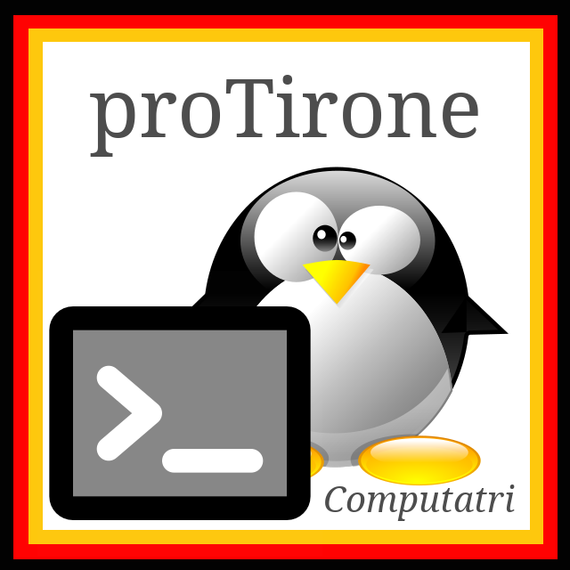

<!--
% This file is part of the Open Source project 'proTirone'
% (c) 2025 Karsten Reincke (https://github.com/protirone/protico.ltx)
% It is distributed under the terms of the Creative Commons license
% CC-BY-4.0 (= https://creativecommons.org/licenses/by/4.0/)
-->

<!-- LTeX:Language=de-DE -->

   
  
    
  

## Freie Lehrmaterialien für die Ausbildung zur Fachinformatikerin.

<!-- LTeX:Language=en-US -->

> *In Germany, there is a second way to become a computer scientist besides studying computer science: you can get an in-company training as an IT specialist, supplemented by vocational school instruction. Ultimately, you are certified by the Chamber of Industry and Commerce (IHK). This repository offers teaching materials in accordance with the official German framework curriculum. The language of instruction is German. Thus, this repository also uses German as the language of teaching material!* 

<!-- LTeX:Language=de-DE -->

### (1) Ziel

Das [proTirone-Manifest](https://github.com/protirone) besagt im Kern, dass wir

* Lehrerinnen und Schülerinnen fertig aufbereitete Unterrichts- und Lerneinheiten für die Ausbildung zur Fachinformatikerin anbieten möchten. 
* den Stoff, den die Abschlussprüfungen I und II erwarten, umfänglich und hochwertig aufbereiten wollen.
* jeder Nutzerin unsere Ergebnisse im Sinne freier Software und Dokumente gebührenfrei anbieten möchten.

Deshalb bieten Ihnen die *proTirone*-Repositories **_freie_ Lehr- und Lernmaterialien für die Ausbildung zur Fachinformatikerin**[^1] in Form von Dokumenten und Skripten,

* die die Vorgaben des Rahmenlehrplans und der Prüfungskataloge erfüllen,
* die sich an die Aufteilung der Lernfelder halten,
* die für sich fertig nutzbare Lehr- und Lernmaterialien bilden,
* die zusammen alle Themen und Aspekte eines Lernfeldes abdecken,
* die CC-BY-4.0 lizenziert sind.

### (2) Inhalt `protico.lessons`

Fertige Unterrichtseinheiten in Form von PDF-Dateien, sortiert nach Lernfeld und intendierter Abfolge bzw. bei Lernfeld-übergreifenden Lektionen gesammelt in einem Cross-Over-Ordner.

### (3) [Lizenz](https://github.com/protirone/protico.ltx/blob/main/LICENSING.md) 

Sofern im Einzelfall nicht anders vermerkt, stehen alle Dokumente unter der [CC-BY-4.0-Lizenz](https://creativecommons.org/licenses/by/4.0/deed.de). Davon ausgenommen ist das [proTirone-Logo](./logo.png): Es darf nur verwendet werden, um das Projekt [proTirone](https://github.com/proi-tirone-computatri/) und dessen Repositories visuell zu markieren bzw. anzuteasern. Die Erfüllung der CC-BY-4.0-Lizenz ist im Dokument [LICENSING.md](./LICENSING.md) näher geregelt.

### (4) Struktur

Das Download-Repository [protico.lessons](https://github.com/proi-tirone-computatri/protico.lessons)

* bietet für jedes Lernfeld des Rahmenlehrplans einen eigenen Ordner [ z.B. `lf.03`, `lf.09`, oder `lf.11c` ] mit Unterrichtseinheiten.
* gliedert den Stoff eines Lernfeldes als Folge von Themen(dateien) [`sbj-00.xyz` bis `sbj-xy.zyx`].
* sortiert die Themendateien nach intendierter Reihenfolge.
* unterteilt ein Thema gelegentlich in Aspekte und stellt zusätzlich die einzelnen Topic-Dateien bereit. [`tpc-00.xyz` bis `tpc-xy.zyx`]
* liefert **für jede Unterrichtseinheit** zu einem Thema
  * **eine _[ZEN-Präsentation](https://www.amazon.de/Zen-oder-die-Kunst-Präsentation/dp/3864907594)_**, anhand derer die Lehrerin den Stoff mündlich einbringt (`sbj-nummer.thema-zenprese.pdf`)
  * **ein entsprechendes _Tonspurdokument_** (`sbj-nummer.thema-ortaltrack.pdf`), das
    * den zur Präsentation zu 'erzählenden' Stoff sprachlich skizziert
    * an passenden Stellen Übungen samt Lösungen enthält
  * optional **ein _Übungsdokument_** (`sbj-nummer.thema-exercise.pdf`), das
    * die Übungen aus dem Tonspurdokument als reine Aufgaben extrahiert
    * und als 'Aufgabenblatt' ausgehändigt werden kann.

Die intendierte Nutzung der Unterrichtseinheiten ist, dass die Lehrerin 

* die Zenpräsentation vorführt
* zu jeder Folie davon den Text aus dem Tonspurdokument erzählt
* an jeder Stelle mit Übung die Aktion an die Schülerinnen übergibt
* am Ende einer Unterrichtseinheit das Tonspurdokument zur Nachbereitung und Wiederauffrischung an die Schülerinnen aushändigt.

Genauer erläutere ich einzelne Unterrichtseinheiten und -aspekte in meinem Blog zum Thema [Berufsschule](https://karsten-reincke.de/tag/berufsschule/) bzw. [Fachinformatik](https://karsten-reincke.de/tag/fachinformatik/)

Anmerkungen:

[^1]: Wir nutzen das generische Femininum. Dort, wo wir es nicht tun, hätten wir es tun sollen und werden nachbessern. Denn nach mehreren Jahrhunderten, in denen es andersherum lief, werden wir Männer es gut einige Jahrzehnte aushalten, wenn nun wir mitgemeint sind, und nicht mehr die Frauen. Die werden das zumeist (wohl) nicht (offen) fordern. Weil sie ja ein gerechteres System wollen. Aber wir Männer können es ihnen von uns aus geben, ritterlich. Das wäre dann unser Beitrag zu einer respektvolleren Welt und zur Bewahrung einer sprachlichen Eleganz. Denn [Sprache ist, was wir draus machen](https://www.amazon.de/Sprache-ist-was-draus-machst/dp/342644612X/).
